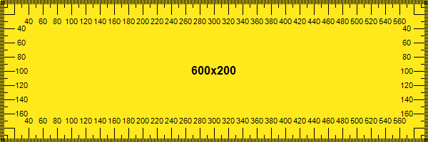
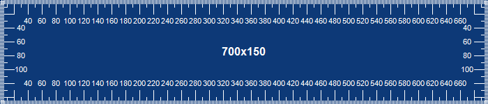

# MeasureTape 

### Pixel metrics measurement tape

Small UI application created for measuring UI components, pads, alignment and other stuff in pixels.

### Keyboard shortcuts

* `ESC` - Exit application
* `R` - Switch offset corner of calculations
* `I` - Invert color
* `+` - Increase pixels per step
* `-` - Decrease pixels per step

### UI screenshots

